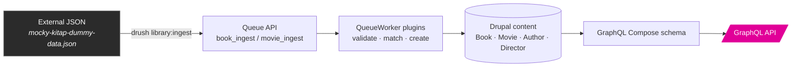
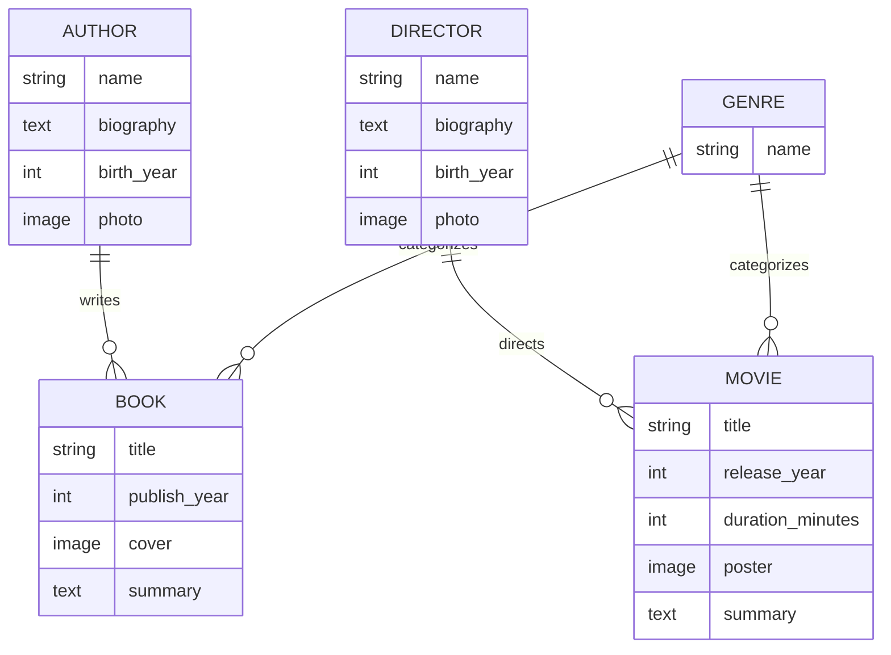

# 📚 Library API — Drupal + GraphQL Compose

**A Book & Movie library, modeled in Drupal and served through a hand-built GraphQL API — ending with an automated pipeline that ingests an external JSON feed straight into the content graph.**

[](https://www.drupal.org)
[](https://www.drupal.org/project/graphql_compose)
[](https://www.php.net)
[](https://ddev.com)
[](LICENSE.txt)

---

## What this is

A 5-week case study, built end to end: content model → read queries →
relational graph traversal → write mutations → autonomous data ingestion.
Every layer is real and runnable — no mocked responses, no `TODO` stubs.
The final result is a live API that can answer questions like *"what has
Frank Herbert written?"* and a Drush command that can pull a fresh batch
of books and movies from an external JSON source and fold it into the
graph without human intervention or duplicate data.



## Content model



`Genre` is a shared taxonomy — one vocabulary, referenced by both `Book`
and `Movie`. Author/Director each get **independent field storages**
(`field_publish_year` vs. `field_release_year`, etc.) rather than shared
ones, keeping the two branches of the model fully decoupled — a decision
that pays off directly in Week 5's queue design (below).

## What's implemented, week by week

| Week | Focus | Highlight |
|---|---|---|
| 1 | Content model | Genre taxonomy + Author/Director/Book/Movie, all fields, all relations |
| 2 | [Queries](docs/week2-queries.md) | List + detail queries, union inline fragments, a documented filtering decision |
| 3 | [Relations & pagination](docs/week3-reverse-references-pagination.md) | Author → books via a **computed Drupal field** (no reverse-reference support in this GraphQL stack), Relay-style cursor pagination, a measured N+1 performance cost |
| 4 | [Mutations](docs/week4-mutations.md) | `createBook` — hand-written on `drupal/graphql`'s Response/Violation pattern, verified against valid, invalid, and unauthenticated requests |
| 5 | [Ingestion](docs/week5-ingestion.md) | Two Queue API workers pulling from an external JSON feed, with fault tolerance, idempotent re-runs, and auto-created related entities |

Read [`docs/demo-summary.md`](docs/demo-summary.md) for the full narrative
— architecture, decisions and reasoning, and a live end-to-end proof
running a real ingested record through the GraphQL API.

## See it work

A single query, taking a title from the external JSON feed all the way
through the queue to a live GraphQL response:

```graphql
{
  nodeBook(id: "2a141268-5115-44fe-81fe-17a981e3a6c8") {
    title
    publishYear
    author {
      ... on NodeAuthor {
        title
        books { ... on NodeBook { title } }
      }
    }
    genre {
      ... on TermGenre { name }
    }
  }
}
```

```json
{
  "data": {
    "nodeBook": {
      "title": "Kozmos",
      "publishYear": 1980,
      "author": {
        "title": "Carl Sagan",
        "books": [{ "title": "Kozmos" }]
      },
      "genre": [{ "name": "Sci-Fi" }]
    }
  }
}
```

`Carl Sagan` didn't exist in the database before ingestion ran — the
pipeline found no matching author by name, created one from the JSON's
`author_name` field, linked it, and mapped the source's Turkish genre
slug (`bilim-kurgu`) to the correct English taxonomy term, all in one
Drush command.

## Tech stack

| Layer | Choice |
|---|---|
| CMS | Drupal 11.4.4 |
| GraphQL server | [`graphql`](https://www.drupal.org/project/graphql) 5.0.0 |
| Schema layer | [`graphql_compose`](https://www.drupal.org/project/graphql_compose) 3.0.0 (`webonyx/graphql-php` 15.34.0) |
| Custom logic | `library_graphql` — one custom module: mutations, reverse-reference computed fields, ingestion pipeline |
| Data ingestion | Drupal core Queue API + a custom Drush command |
| Local environment | [DDEV](https://ddev.com) (Docker-based) |
| CLI | Drush 13.7 |

No contrib module was added for mutations, reverse references, or
ingestion — all three are hand-written against Drupal core and base
`drupal/graphql`'s own documented extension points.

## Getting started

```bash
# 1. Clone and enter the project
git clone https://github.com/mehmetgokgul/drupal-library-api.git
cd drupal-library-api

# 2. Spin up the environment (Docker required)
ddev start

# 3. Install dependencies
ddev composer install

# 4. Install Drupal against the exported configuration
ddev drush site:install --existing-config -y

# 5. Rebuild caches
ddev drush cr
```

Then:

- Browse the schema and run queries at
  `/admin/config/graphql/servers/manage/graphql_compose_server/explorer`
  (log in as an administrator first — the raw `/graphql` endpoint is
  intentionally closed to anonymous requests).
- Run `ddev drush library:ingest` to trigger the Week 5 ingestion pipeline
  against the bundled sample JSON feed
  (`web/modules/custom/library_graphql/data/mocky-kitap-dummy-data.json`).
  Safe to run repeatedly — it's idempotent.

## Project structure

```
web/modules/custom/library_graphql/
├── data/                          sample external JSON feed
├── graphql/                       hand-written SDL (mutation schema)
├── src/
│   ├── Field/                     computed reverse-reference fields (Week 3)
│   ├── GraphQL/Response/          Response/Violation objects (Week 4)
│   ├── Ingest/                    shared ingestion helpers (Week 5)
│   ├── Plugin/GraphQL/            SchemaExtension + DataProducer plugins
│   ├── Plugin/QueueWorker/        Book/Movie ingestion workers
│   └── Drush/Commands/            `library:ingest` trigger command
docs/                              week-by-week write-ups + full project summary
config/sync/                       exported site configuration (188 files)
```

## Engineering notes worth reading

A few decisions that shaped the project and are documented in full in
`docs/`:

- **Config vs. bug** — a two-day "the schema is empty" investigation
  turned out to be two config settings behaving exactly as designed, not
  a defect. Full elimination trail in `docs/week3-reverse-references-pagination.md`.
- **Two ingestion queues, not one** — Book and Movie share zero field
  machine names by design (Week 1's separate-storage decision), so a
  single worker with a type switch would only hide the branching, not
  remove it.
- **Auto-create over skip** — when the JSON references an author/director
  that doesn't exist yet, ingestion creates a minimal record rather than
  rejecting the whole entry. Checked against real data first: roughly
  40% of the sample books reference an author not yet in the database.
- **Titles are never overwritten on update** — only used to find the
  matching record, so hand-curated titles survive repeated ingestion runs
  untouched.

## License

GPL-2.0-or-later (matches Drupal core's own licensing).
